# Few-Shot Segmentation with SAM and LoRA

## Overview

The project leverages the segmentation capabilities of SAM, allowing for the segmentation of images based on different class prompts. Each segmentation class receives a different prompt encoding (from a random positive point), and the model is fine-tuned using LoRA to produce the desired segmentation mask based on this encoding.

## Key Ideas

Using LoRA we can leverage the SAM model to segment classes we want using very few images with no
use of any prompt(given manual or using a detection model such as grounding sam, yolo world etc...)
previous works in the subject such as PerSAM gives worst results and cant utilize diffrent classes

## Examples

### COCO

I trained using this method on coco2017,
I trained using vit_t (MobileSAM) with LoRA rank 16
on these super classes:

0. person
1. vehicle
2. outdoor
3. animal
4. accessory
5. sports
6. kitchen
7. food
8. furniture
9. electronic
10. appliance
11. indoor

<table>
<tr>
<th>Ground Truth Segmentation</th>
<th>Predicted Segmentation</th>
</tr>
<tr>
<td>

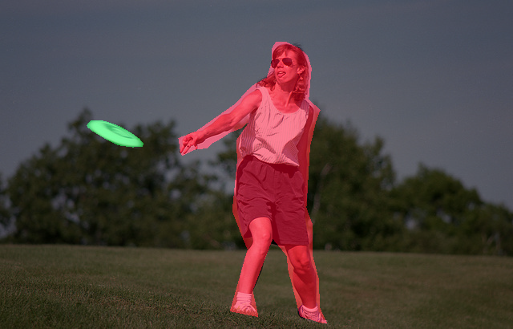
</td>
<td>


</td>   
</tr>
<tr>
<td>


</td>
<td>


</td>   
</tr>

</table>


Note: this is the results after 36000 steps. 
It looks like there is a lot of noise in some sitution between some of the classes at 36000 steps point, it's imporving,
I am training on macbook give me some slack (: 

After that I train on a smaller number of classes:
1.  person
2. vehicle
3. animal
4. food

which looks alot more stable 


<table>
<tr>
<th>Ground Truth Segmentation</th>
<th>Predicted Segmentation</th>
</tr>
<tr>
<td>

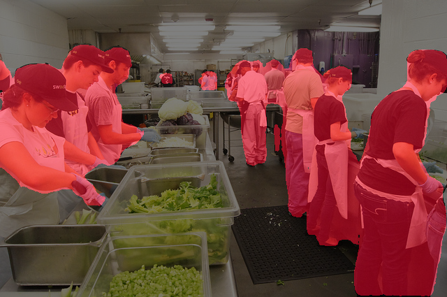
</td>
<td>

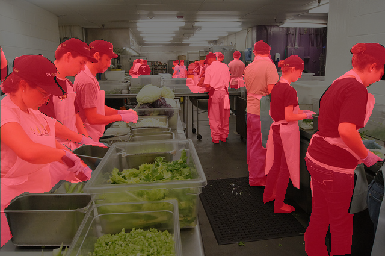
</td>   
</tr>
<tr>


</tr>


</table>

After that I train with only one the class of person, the results were very accurate with very minimal
false positive and negative, also it looks like sometimes the predicted mask is even more strict on the person then the not very good ground
truth of coco as you can see in the image below that the mask on the man with the baseball bat looks much better in the predicted mask.

<table>
<tr>
<th>Ground Truth Segmentation</th>
<th>Predicted Segmentation</th>
</tr>
<tr>
<td>

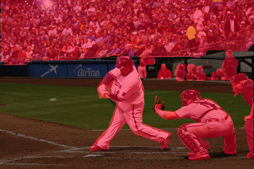
</td>
<td>

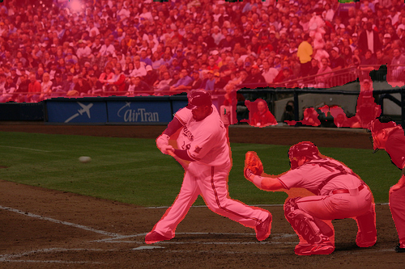
</td>   
</tr>
<tr>


</tr>


</table>


### Soccer dataset

I trained using this method on few shot  [Soccer dataset](https://www.kaggle.com/datasets/sadhliroomyprime/football-semantic-segmentation)
I trained using vit_t (MobileSAM) with LoRA rank 8, with those classes:

1. Advertisement
2. Goal Bar
3. ball
4. ground
5. team red
6. team black
7. refree


<table>
<tr>
<th>Ground Truth Segmentation</th>
<th>Predicted Segmentation</th>
</tr>
<tr>
<td>

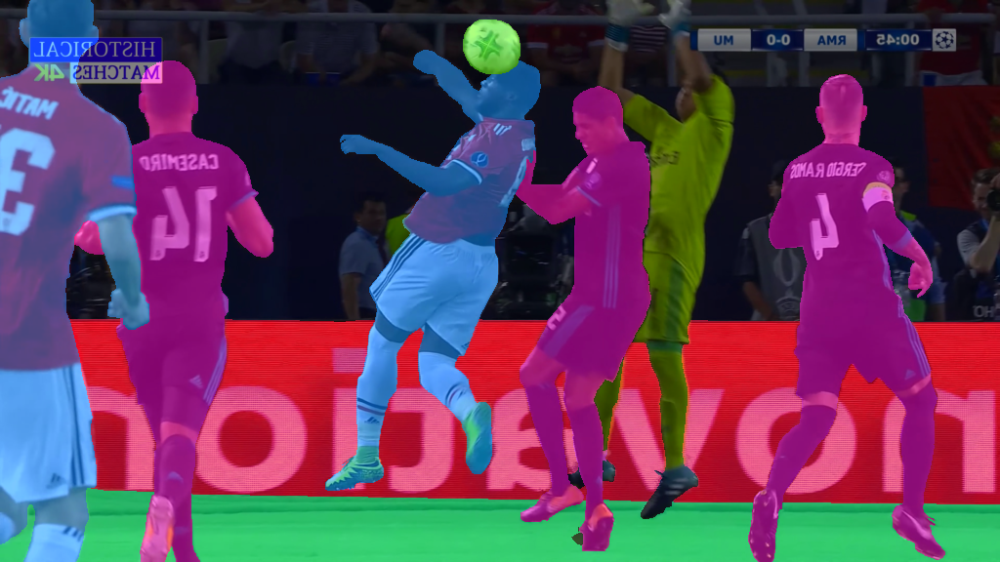
</td>
<td>

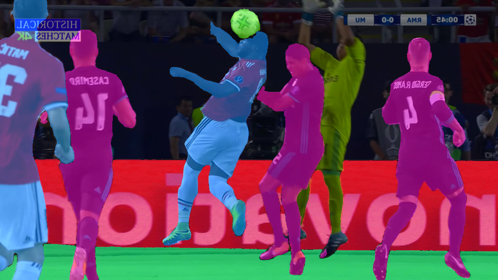
</td>   
</tr>
<tr>
<td>

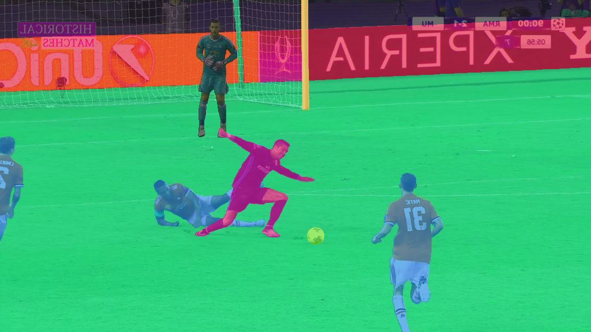
</td>
<td>


</td>   
</tr>

</table>

I split it such there are 70 training images and 30 validation.
### Cityscapes

I trained on [Cityscapes](https://www.cityscapes-dataset.com) dataset with four classes:
1. cars
2. building
3. road
4. people

<table>
<tr>
<th>Ground Truth Segmentation</th>
<th>Predicted Segmentation</th>
</tr>
<tr>
<td>

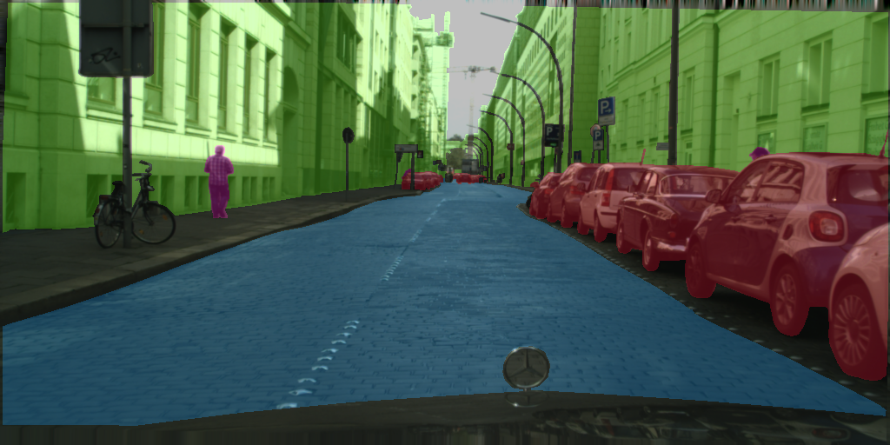
</td>
<td>

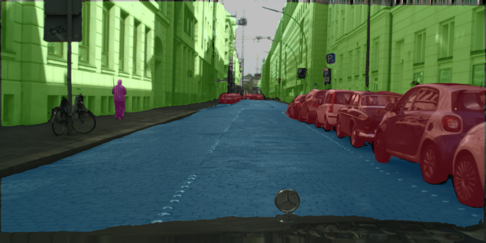
</td>   
</tr>
<tr>
<td>

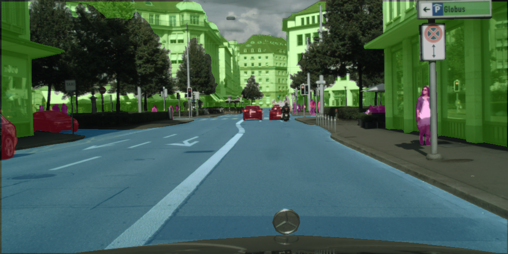
</td>
<td>

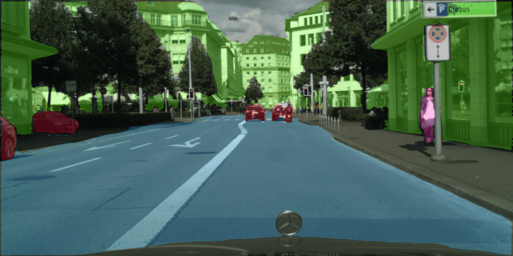
</td>   
</tr>
</table>

## TBD


- [X] test on coco dataset with diffrent amount of annotations
- [X] add diffrent loss, for class precision 
- [ ] implament for efficentvit SAM


## Getting Started

### Installation

Clone the repository
```bash
git clone https://github.com/amit154154/SAM_LORA.git
```

### set the dataset

sort your dataset such that there is a folder of train images, folder of segmentation masks and the same for training.
create a txt file such that each line is the class id (which it has in the segmentation masks) and the class name.
look at the example(labels_example).

### train the model
look at the params you need to add in train.py

```bash
python train.py
```


